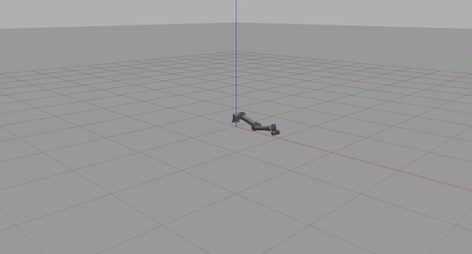
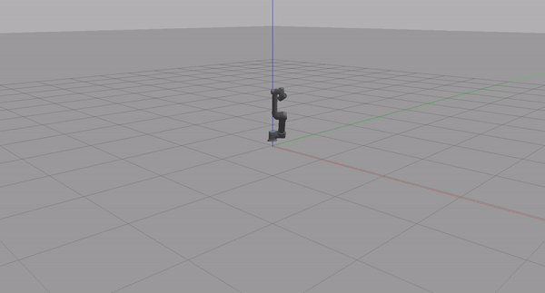
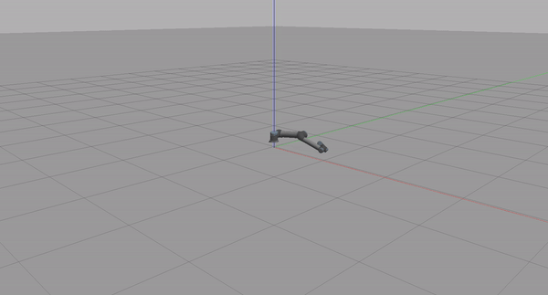

# UR5 Custom Controller - ROS and Gazebo Interface

This project focuses on simulating and controlling a UR5 robotic arm using the Robot Operating System (ROS) and Gazebo. The goal is to implement custom controllers for various types of motion (joint space, Cartesian space, and sine wave motion) to control the UR5 robot precisely and provide real-time feedback.

---

## Project Structure

```plaintext
<ur5_controller_project>
│
├── src/
│   ├── sine_wave_publisher.py
│   ├── joint_space_motion.py
│   ├── cartesian_motion.py
│   ├── motion_api.py
│
├── include/
│   ├── CMakeLists.txt
│
└── launch/
    ├── sine_wave_publisher.launch
    ├── joint_space_motion.launch
    ├── cartesian_motion.launch
    ├── motion_api.launch
```

---

## Prerequisites
### Additional Required Libraries

The following libraries are required to run the UR5 custom controller scripts:

1. **rospy** - ROS Python client library (should already be installed with ROS).
2. **sensor_msgs** - ROS message type (comes with ROS installation).
3. **trajectory_msgs** - ROS message type for joint trajectories.
4. **tf** - ROS library for coordinate transformations.
5. **trac_ik_python** - Python binding for the TRAC-IK solver (used for inverse kinematics).
6. **math** - Standard Python library (pre-installed).
7. **os** - Standard Python library (pre-installed).
8. **subprocess** - Standard Python library (pre-installed).

### Installation of Required Libraries

Make sure the following ROS libraries are installed:

```bash
sudo apt install ros-noetic-trajectory-msgs ros-noetic-tf ros-noetic-sensor-msgs
```

Additionally, you will need to install the **TRAC-IK** solver for inverse kinematics:

```bash
sudo apt install ros-noetic-trac-ik
```


- **Windows Subsystem for Linux 2 (WSL2)**
- **Ubuntu 20.04**
- **ROS Noetic**
- **Gazebo**

---

## 1. Setting Up Simulation Environment

### 1.1. Install WSL2 and Ubuntu

1. Open PowerShell as administrator and run:
   ```bash
   wsl --install
   ```
If Ubuntu isn’t installed automatically, you can manually install  **Ubuntu 20.04 LTS** from the [Microsoft Store](https://apps.microsoft.com/detail/9mttcl66cpxj?hl=en-US&gl=US). 

2. Enable Virtual Machine Platform and WSL Features
To run WSL2, you need to enable the Virtual Machine Platform and Windows Subsystem for Linux features. Open PowerShell as an administrator and run the following commands:
```bash
dism.exe /online /enable-feature /featurename:VirtualMachinePlatform /all /norestart
dism.exe /online /enable-feature /featurename:Microsoft-Windows-Subsystem-Linux /all /norestart
```
3. After enabling the necessary features, restart your system.


### 1.2. Install ROS Noetic

Follow the official [ROS Noetic installation guide](http://wiki.ros.org/noetic/Installation/Ubuntu).
1. Add ROS Repository and Key
   ```bash
   echo "deb [signed-by=/usr/share/keyrings/ros-archive-keyring.gpg] http://packages.ros.org/ros/ubuntu focal main" | sudo tee /etc/apt/sources.list.d/ros-latest.list > /dev/null
   ```
2. Add the GPG key:
   ```bash
   sudo apt-key adv --keyserver hkp://keyserver.ubuntu.com:80 --recv-keys F42ED6FBAB17C654
   ```

3. Update your package list:
   ```bash
   sudo apt update
   ```

4. Install ROS Noetic Desktop Full:
   ```bash
   sudo apt install ros-noetic-desktop-full
   ```

5. Optionally, upgrade existing packages:
   ```bash
   sudo apt upgrade
   ```

6. Initialize `rosdep`:
   ```bash
   sudo rosdep init
   ```
   > **Note:** If you encounter the error `sudo: rosdep: command not found`, install `python3-rosdep`:
   ```bash
   sudo apt install python3-rosdep
   ```

7. Update `rosdep`:
   ```bash
   rosdep update
   ```

### 1.3. Clone the UR5 Robot Package

1. Create a Catkin workspace and clone the universal robot repository:
   ```bash
   mkdir -p ~/ur5_ws/src
   cd ~/ur5_ws/src
   git clone https://github.com/ros-industrial/universal_robot.git
   ```
   
2. Build the workspace:
   ```bash
   cd ~/ur5_ws
   catkin_make
   source devel/setup.bash
   ```

### 1.4. Launch UR5 in Gazebo

Start the UR5 robot in Gazebo:
```bash
roslaunch ur_gazebo ur5.launch
```
This should open Gazebo and load the UR5 robot model. 


---

## 2. Writing Custom ROS Nodes for UR5 Control

### 2.1. Create ROS Package

Create a new ROS package for controlling the UR5 robot:
```bash
cd ~/ur5_ws/src
catkin_create_pkg Gazebo_ur5_ros_Marwan rospy std_msgs sensor_msgs
```

### 2.2. Writing Control Nodes

#### Sine Wave Publisher

This node will publish sine wave joint positions to control the UR5:
```bash
touch sine_wave_publisher.py
nano sine_wave_publisher.py
```

#### Joint Space Motion

A node to move between two joint positions:
```bash
touch joint_space_motion.py
nano joint_space_motion.py
```

#### Cartesian Motion

A node to perform linear motion between two Cartesian poses:
```bash
touch cartesian_motion.py
nano cartesian_motion.py
```

#### Motion API

An API that selects between the different motion types:
```bash
touch motion_api.py
nano motion_api.py
```

### 2.3. Create Launch Files

#### Sine Wave Publisher Launch

Create a launch file for running the sine wave publisher node:
```bash
cd ~/ur5_ws/src/Gazebo_ur5_ros_Marwan/launch
touch sine_wave_publisher.launch
nano sine_wave_publisher.launch
```

Add the following content:
```xml
<launch>
    <include file="$(find ur_gazebo)/launch/ur5_bringup.launch" />
    <node pkg="Gazebo_ur5_ros_Marwan" type="sine_wave_publisher.py" name="sine_wave_publisher" output="screen"/>
</launch>
```

#### Joint Space Motion Launch

Create a launch file for joint space motion control:
```bash
touch joint_space_motion.launch
nano joint_space_motion.launch
```

#### Cartesian Motion Launch

Create a launch file for Cartesian space motion control:
```bash
touch cartesian_motion.launch
nano cartesian_motion.launch
```

#### Motion API Launch

Create a launch file for running the motion API node:
```bash
touch motion_api.launch
nano motion_api.launch
```

Add the following content:
```xml
<launch>
    <include file="$(find ur_gazebo)/launch/ur5_bringup.launch" />
    <node pkg="Gazebo_ur5_ros_Marwan" type="motion_api.py" name="motion_api" output="screen"/>
</launch>
```

---

## 3. Python API for UR5 Motion Control

The `motion_api.py` file provides a simple Python API that allows users to control the robot via:

- Reading robot state (joint angles, Cartesian pose).
- Moving the robot with joint space and Cartesian space motion commands.


---

## 4. Running the Simulation

Follow these steps to run the simulation and control the UR5 robot.

Open three terminals:

1. In **each terminal**, run the following command to set up the environment:
   ```bash
   source ~/ur5_ws/devel/setup.bash
   ```

2. **Terminal 1**: Start the ROS core:
   ```bash
   roscore
   ```

3. **Terminal 2**: Launch UR5 in Gazebo:
   ```bash
   roslaunch ur_gazebo ur5_bringup.launch
   ```

4. **Terminal 3**: Run the motion API:
   ```bash
   rosrun Gazebo_ur5_ros_Marwan motion_api.py
   ```

5. Use the API to select and execute the desired motion (sine wave, joint space, Cartesian).

---

## 5. Integrating LLM-Based Code Suggestions

To enhance developer productivity, we propose integrating an open-source LLM (e.g., GPT-Neo) to provide code suggestions for controlling the UR5 robot using the custom motion API.

### Key Idea:
- **User Input**: Developers can input specific queries about controlling the UR5 robot (e.g., "How to move the robot in Cartesian space?").
- **LLM Response**: The LLM will return relevant Python code snippets based on the API.

### Code Flow Diagram:

This diagram illustrates the workflow of how the LLM-based suggestion system would operate:

```
+-------------------------------------------+
|           Python-based Interface          |
+-------------------------------------------+
                   |
                   v
+-------------------------------------------+
|       User Inputs Code Question (API)     |
+-------------------------------------------+
                   |
                   v
+-------------------------------------------+
|        LLM Model (e.g., GPT-Neo)          |
+-------------------------------------------+
                   |
                   v
+-------------------------------------------+
|   Returns Suggested Code Snippet (Python) |
+-------------------------------------------+
                   |
                   v
+-------------------------------------------+
|   User Receives Code and Implements It    |
+-------------------------------------------+
```

### Implementation Overview:
1. **User Interface**: A simple Python-based command-line interface.
2. **User Query**: User asks for specific code (e.g., Cartesian motion or sine wave motion).
3. **LLM Processing**: The query is processed by an LLM (e.g., GPT-Neo), which generates a code snippet.
4. **Code Output**: The code is displayed to the user for implementation.

---

## Example Videos and GIFs

### Sine Wave Motion


### Joint Space Motion


### Cartesian Motion


---

By following these steps, you can successfully simulate and control a UR5 robot using ROS and Gazebo. This README provides a comprehensive guide to setting up the simulation environment, writing custom ROS nodes, and controlling the robot via a Python API.
